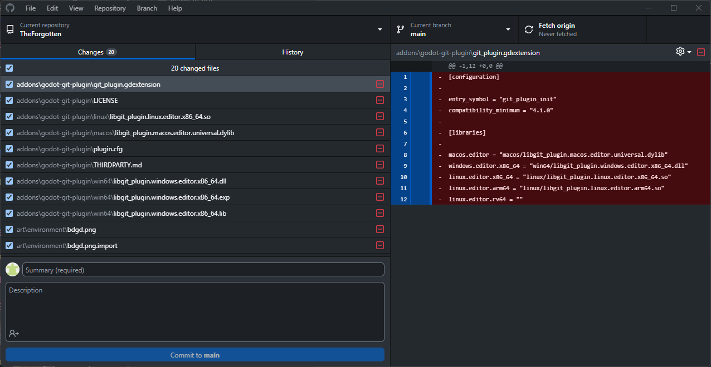
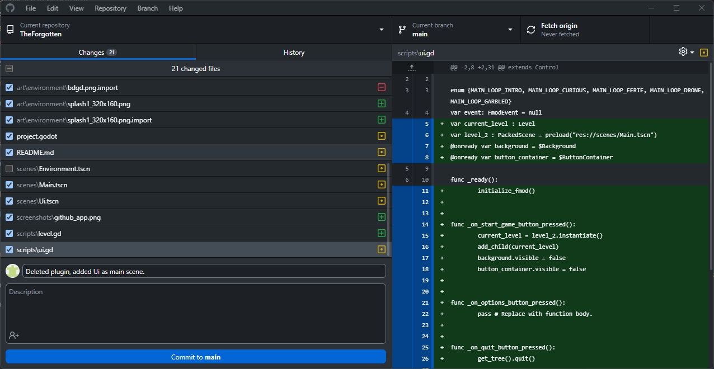

# The Forgotten

Space game made by the CollabCrew.

## Download Godot Engine

Get the latest version (4.2.1).  
[Godot Download](https://godotengine.org/)

## Guide to using GitHub

Collaboration is fun! But sometimes it can be tricky to keep everyone's work in sync, which makes it important to communicate your changes with the group. Here are some sensible steps to keep all the changes synchronized.

Make sure everything is saved in Godot! You will not be able to see your changes unless you have all your files saved.

From the Github Desktop app, you can view your changes:

### Making a Commit

The first part of the process is to make a commit or save your changes with git. The commits are added to the git database locally and online to keep a history of any changes made and to make sure to catch things which might cause someone's work to be overwritten.

Go down the list and select the items you have worked on and wish to push to the main branch:

You should uncheck the files you do not want to send and then Right Click -> Discard Changes to mimimize any conflicts:

Now enter an informative message about what the commit contains and hit the commit button!

